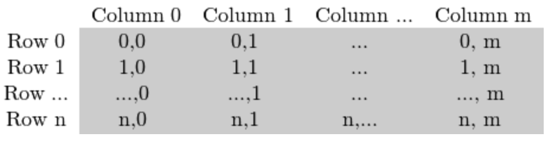
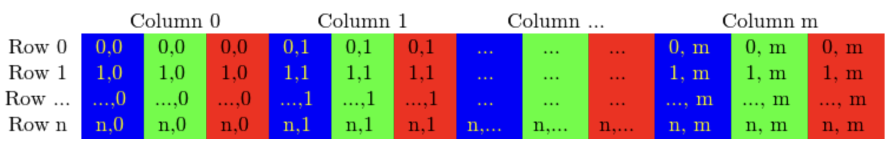

# OpenCV

<hr>

https://docs.opencv.org/3.4/d9/df8/tutorial_root.html

## Table of Contents

> [Basics](#basics)

<hr>

## Basics

```python
# import statement
import cv2 as cv

# read an image data, store as cv::Mat object
img = cv.imread("PATH_TO_IMAGE")

# check if an image was loaded correctly
if img is None:
    exit()

# display image data
cv.imshow("WINDOW TITLE", img)
k = cv.waitKey(0)       # display window until any key is pressed
```

### `Mat` Object

A class with two data parts: a matrix header and a pointer to matrix containing pixel values.

- Image processing is often computationally heavy, so copy operators only copy headers and pointers (shallow copy), without actually duplicating the pixel data matrix (aliases).
- Aliases for the same pixel data matrix can have different headers. This is often used to extract a subsection of an image (by slicing).
  - To create a deep copy, use the `.clone()` or `.copyTo(DESTINATION)` class functions.

### Color Spaces

A color space describes how different component colours mix to code a given color. Here are some examples:

- **RGB** => red, green, blue
  - most commonly used color space because our eyes do something similar
  - by default, OpenCV actually uses BGR
- **HSV** => hue, saturation, value/luminance
  - most natural way to describe color
- **YCrCb** => luminance, chroma red, chroma blue
  - used by the JPEG image format
- **CIE L\*a\*b\*** => lightness, green-red, blue-yellow
  - a perpetually uniform color space, can measure _distance_ between colors

A `Mat` object for a greyscale image:


A `Mat` object for an RGB image:


### Mask Operations
